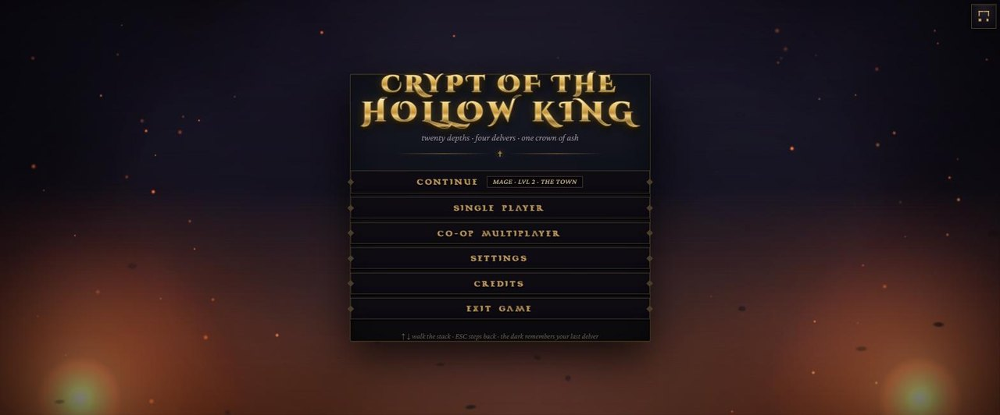
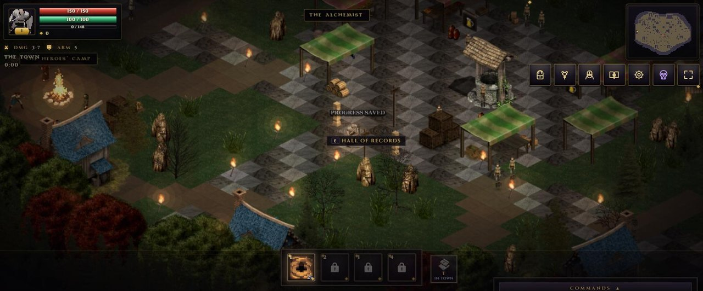
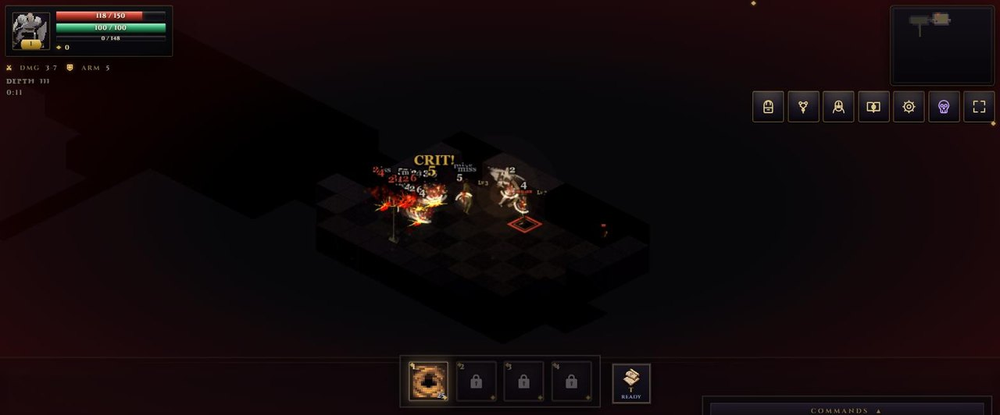
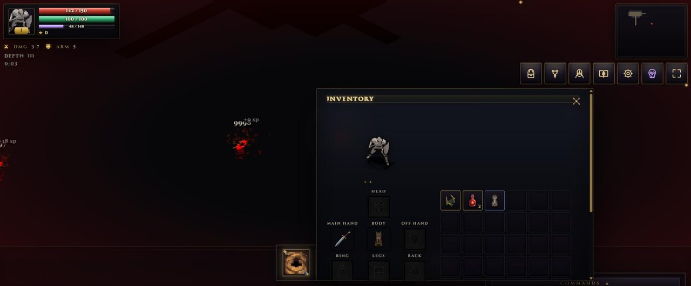
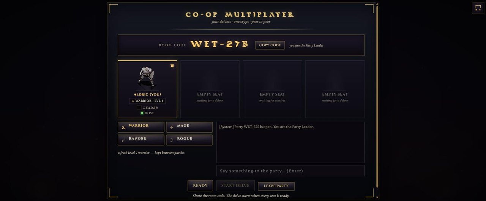
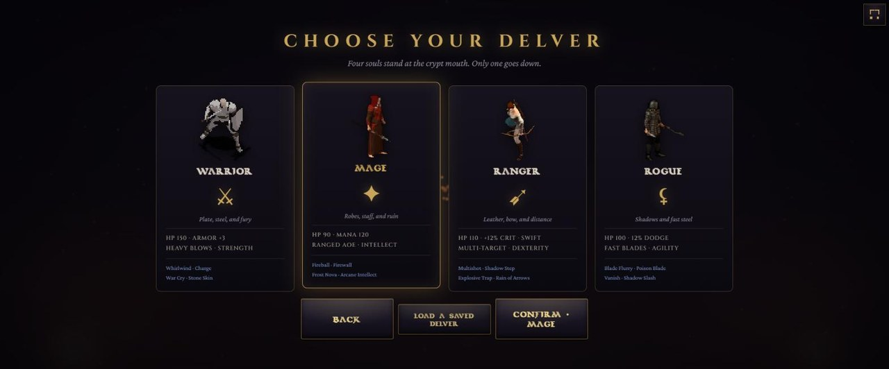
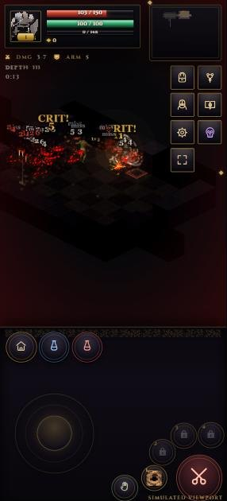

<p align="center">
  
</p>

<h1 align="center">Crypt of the Hollow King</h1>

<p align="center">
  A dark-fantasy isometric action RPG for the browser.<br>
  Twenty depths. Four delvers. One crown of ash.
</p>

<p align="center">
  <a href="https://illiakomissarov.github.io/isometric-game/"><b>▶ Play in the browser</b></a>
  &nbsp;·&nbsp;
  <a href="#getting-started">Getting started</a>
  &nbsp;·&nbsp;
  <a href="#controls">Controls</a>
  &nbsp;·&nbsp;
  <a href="#multiplayer">Multiplayer</a>
  &nbsp;·&nbsp;
  <a href="STATE_ARTIFACT.md">State artifact</a>
</p>

<p align="center">
  
  
  
  
  
</p>

---

## Screenshots

<table>
  <tr>
    <td align="center"><br><sub>The town: shop, stash, coliseum gate and the heroes' camp</sub></td>
    <td align="center"><br><sub>Depth III: crits, misses and knockback in torchlight</sub></td>
  </tr>
  <tr>
    <td align="center"><br><sub>The inventory: a live paperdoll, gear slots and quick draughts</sub></td>
    <td align="center"><br><sub>The co-op lobby: a room code, four seats, chat</sub></td>
  </tr>
  <tr>
    <td align="center"><br><sub>Four delvers: warrior, mage, ranger, rogue</sub></td>
    <td align="center"><br><sub>A phone held upright: the crypt above, the control pad below</sub></td>
  </tr>
</table>

## What it is

- **An action RPG in the classic mould.** A 60 Hz simulation with wind-up, strike and recovery
  frames, to-hit rolls, crits, knockback, hit recovery and stagger. Melee, bows and wands. Four
  classes with talent paths, synergies and passives. Loot in six rarities with item levels,
  affixes, legendary uniques and mythic passives, on a paperdoll with an item card that lays
  every piece beside what you wear and calls the verdict. Weapons with a role and an innate:
  bleed, poison, burn, chill, shock and stun on hit, or a granted trait, and twelve forge
  enchantments learned from scrolls. A camp forge to salvage, forge, transmute, refine,
  enchant and reinforce to +15, with a recipe book. An assignable draught belt with cooldowns.
  Merchants with a buyback counter and a restock clock.
  A warden every fifth depth, with phases.
- **Four-player co-op with no server.** WebRTC data channels brokered by PeerJS. Deterministic
  lockstep carries only intent; the Party Leader is the authority for every creature, hero and
  fallen item, ten times a second, so screens never drift apart. Room codes, a lobby with
  portraits and latency, party chat, a shared stash.
- **Join and rejoin any time.** A dropped player is back in the same seat with one tap. A new
  player joins a delve in progress from a 3 KB world snapshot and is live in a few seconds.
  Portals move the whole party at once.
- **A HUD that fits every screen.** From a 240 px feature phone to an 8K monitor, verified across
  74 device configurations: a status plate, a folding system bar, a tappable chart, a thumb stick
  that spawns under the finger, a skill arc with icons and cooldowns, haptics, and windows that
  reflow instead of shrinking.
- **Light as the enemy.** A per-tile lightmap tints the world, walls cut away when they hide
  you, embers and mist drift through the dark, and a resolution scaler keeps 60 FPS on weak
  hardware.

## Tech stack

| Layer | What |
| --- | --- |
| Language | TypeScript 5.7, strict, ES2022 |
| Renderer | Pixi.js 8.6 — WebGL, sprite batching, render groups, colour grading |
| Simulation | Fixed 60 Hz step with render interpolation, Web Worker clock in hidden tabs |
| Movement and AI | Square colliders, spatial-hash separation, A* with a binary heap |
| Randomness | Seeded mulberry32 streams with readable state |
| Networking | PeerJS 1.5 over WebRTC, custom lockstep, leader-authoritative state sync |
| Audio | Web Audio synthesis for effects, streamed music |
| UI | Hand-written DOM, SVG icons, an obsidian-glass design system |
| Items | 160 Raven-icon bases, instances encoded in the id, `stat = base × 1.08^(iLvl−1) × rarity × (1 + 0.05·upgrade)` |
| Persistence | Versioned `localStorage` saves, co-op hero slots, floor memories |
| Build and deploy | Vite 6 with vendor chunks, `tsc --noEmit`, GitHub Pages |

No backend, no accounts, no analytics. Everything runs in the browser.

## Getting started

```bash
npm install
npm run dev        # http://localhost:5173
npm run typecheck  # tsc --noEmit
npm run build      # typecheck + production bundle in dist/
npm run deploy     # build for GitHub Pages and publish gh-pages
```

Handy URL parameters while developing: `?seed=42` pins the dungeon, `?class=mage` skips the
menu, `?depth=3` starts on a floor. Dev builds expose `window.__game` (the live run;
`loop.step(n)` advances the simulation), `window.__menu` (the title flow) and `window.__layout`
(layout, performance scaler, touch controls).

Two QA harnesses ship in `src/dev/` and never reach a build:

```js
await import('/src/dev/qa66.ts'); __qa66(true)            // the device matrix
await import('/src/dev/qa75.ts'); await __qa75({ seed: 3, cls: 'mage', deep: true })  // a full scripted playthrough
```

## Controls

<table>
  <tr>
    <th align="left">Desktop</th>
    <th align="left">Touch</th>
  </tr>
  <tr>
    <td valign="top">

| Action | Keys |
| --- | --- |
| Move / target | Left click, or W A S D |
| Strike | Space / F (hold) |
| Interact / loot | E |
| Skills | 1 2 3 4 |
| Potion / mana | Q / R |
| Inventory · talents · hero · bestiary | I · K · C · B |
| Map · depths · town portal | M · L · T |
| Settings · pause | O · Esc |
| Zoom | Mouse wheel |
| Forbidden Arts | F1 or backtick |
| Party chat | Enter |

</td>
    <td valign="top">

- **Left thumb:** the stick spawns where you press; the draughts sit above it.
- **Right thumb:** attack in the corner, four skills on an arc with icons and cooldown sweeps, an open hand to interact. Fades when idle, wakes on touch.
- **Top-left:** the status plate — portrait, level, health, resource, experience, gold, buffs.
- **Top-right:** the chart (tap to enlarge) and the system bar — inventory, talents, hero, bestiary, menu, Forbidden Arts, fullscreen.
- Portrait phones get a control pad under the crypt; landscape floats the controls over the whole canvas.
- The first touch asks for fullscreen. Settings has a Virtual Controls switch and a Vibration toggle.

</td>
  </tr>
</table>

## Multiplayer

**CO-OP MULTIPLAYER** on the title. **CREATE PARTY** gives a room code; friends **JOIN** with it.
The leader's feet open stairs, gates and portals and the whole party travels together. If you
drop, **REJOIN LAST PARTY** puts you back in your seat. Phone hotspots and strict carrier NAT
need a TURN relay: paste any free TURN account's credentials under **NETWORK RELAY** (they stay
in your browser).

## Architecture

The simulation is a pure function of a seed and an ordered command stream. Input becomes a
serialisable command, queued and drained once per fixed tick. Rendering reads entity state and
never writes it. That is what lets four peers agree.

```
DOM / touch ─▶ InputBindings ─▶ InputQueue ─▶ GameLoop (60 Hz) ─▶ Systems ─▶ Entities
                                     │                                  │
                              Lockstep (co-op)                   Pixi scene graph
                             frames over PeerJS            Lighting · Culling · Camera
                                     │
                            StateSync (leader authority)
```

```
src/
  core/      GameLoop, InputQueue, StateManager, AssetManager, OrientationManager,
             PerformanceScaler, VisualSettings, Haptics, EventBus
  engine/    Viewport, Camera, Lighting, Ambience, AudioManager
  entities/  Entity, Player, Enemy, EnemyPool
  systems/   Combat, Movement, Collision, Pathfinding, Projectiles, Skills, SkillTree,
             Inventory, Loot, Chests, Town, StatsManager
  scenes/    DungeonGenerator, Coliseum, Props, SceneManager
  town/      TownMap, TownProps, Villagers, CampHeroes
  net/       PeerNet, Lockstep, StateSync
  render/    SpriteLibrary, Vfx, DamageText, Gore, Culling
  ui/        StatusFrame, SystemBar, TouchControls, VirtualJoystick, Minimap, panels,
             menus, lobby, chat, FitScaler, icons
  items/     catalog          persist/  SaveGame          utils/  iso, rng, Vec2
  dev/       QA harnesses (never bundled)
docs/        development log, checklists, technique notes, screenshots
```

Invariants every change keeps:

- No `Math.random()` or wall clock in simulation code.
- Projection math lives only in `src/utils/iso.ts`; spatial queries go through the scene.
- Simulation never reads a container's `visible` or `renderable`.
- Every co-op mutation is a command in the stream; the leader's sync only pulls peers toward the leader.

## Documentation

- [`STATE_ARTIFACT.md`](STATE_ARTIFACT.md) — health scorecard, component matrix, audit log, known issues, roadmap.
- [`docs/development_log.md`](docs/development_log.md) — every iteration: what shipped, what broke, what was measured.
- [`docs/skills/`](docs/skills/) — technique notes: lockstep and state sync, adaptive HUD, lighting, combat model, atlas pipeline.
